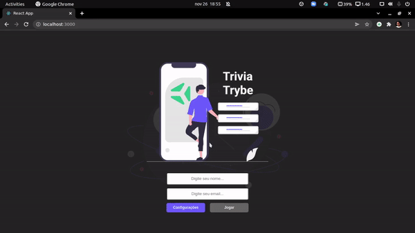

# Bem vindo ao repositório do Projeto Trybe Trivia!

## Introdução:

Projeto em grupo onde pude aprimorar minhas soft-skills como comunicação, liderança e inteligência emocional. Meu grupo foi composto por:

- [Caio Lima](https://www.linkedin.com/in/caio-limah/)
- [Eric Cruz](https://www.linkedin.com/in/effolex/)
- [Pedro Henrique](https://www.linkedin.com/in/pedrohenriquer/)
- [Diego Silva](https://www.linkedin.com/in/diegojorgesilva/)

Ferramentas e habilidades utilizadas:

- **REACT**
- **REDUX**
- **REDUX THUNK**
- **JAVASCRIPT**
- **CSS**
- **FIGMA**

## Instruções:

### Obs: Esse projeto foi desenvolvido na resolução de 1366x768. Portanto, se outra resolução for utilizada alguns elementos podem ter seu posicionamento modificado.

Para visualizar esse projeto rodando no seu navegador, basta acessar [este link](https://triviatrybe.herokuapp.com/).
